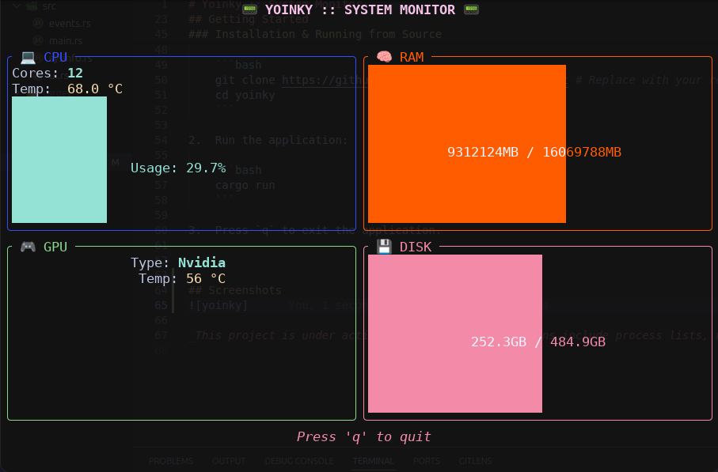

# 🛰️ Yoinky :: System Monitor

 <!-- Replace with a real screenshot URL -->

A lightweight and efficient terminal-based system monitor for Linux, built with Rust 🦀. Yoinky provides a real-time, at-a-glance view of your system's key metrics in a clean and boxy terminal user interface.

## ✨ Features

- **💻 CPU Monitoring**: Tracks core count, temperature, and overall usage percentage.
- **🧠 RAM Monitoring**: Displays current memory usage with a progress gauge.
- **🎮 GPU Monitoring**: Detects GPU type (Nvidia/AMD) and shows its temperature.
- **💾 Disk Monitoring**: Shows total disk usage for your root partition.
- **🎨 Modern TUI**: A clean, segmented interface built with `ratatui`.
- **🚀 Lightweight**: Written in Rust for performance and low resource consumption.

## 🛠️ Technology Stack

- **[Rust](https://www.rust-lang.org/)**: The core programming language, chosen for its safety and performance.
- **[ratatui](https://ratatui.rs/)**: A TUI (Terminal User Interface) library for creating rich, interactive terminal applications.
- **[crossterm](https://github.com/crossterm-rs/crossterm)**: A terminal manipulation library used as a backend for `ratatui`.
- **[procfs](https://github.com/eminence/procfs)**: A library to access system and process information from the `/proc` filesystem on Linux.

## 🚀 Getting Started

### ✅ Prerequisites

- [Rust](https://www.rust-lang.org/tools/install) (and Cargo) installed on your system.
- On NVIDIA systems: `nvidia-smi` command-line tool must be installed and in your PATH.
- On AMD systems: `rocm-smi` may be required for temperature readings on newer cards.

### 📦 Easy Installation & Running

1.  Install Yoinky using Cargo:

    ```bash
    cargo install yoinky
    ```

2.  Run the application:

    ```bash
    yoinky
    ```

### 👨‍💻 Installation & Running from Source

1.  Clone the repository:

    ```bash
    git clone https://github.com/your-username/yoinky.git # Replace with your repo URL
    cd yoinky
    ```

2.  Run the application:

    ```bash
    cargo run
    ```

3.  Press `q` to exit the application.

---

## 🖼️ Screenshots



_This project is under active development. Future plans include process lists, network monitoring, and more detailed hardware information!_
